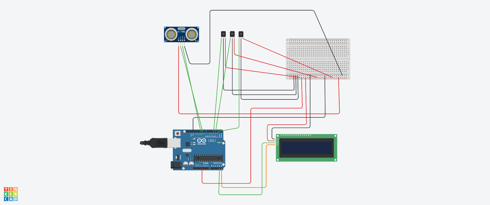

# Embedded AI ML Internship-2024
<h3> Student name :- Monika T N</h3>
<h3>College Name :- BMS College of Engineering</h3>
<h3> College Mail Id :- monika.ec22@bmsce.ac.in</h3> 

  
  <h2> Smart Car Parking System</h2> 
 
  <h3>Overview:</h3> The Smart Car Parking System is designed to offer a efficient parking experience, reducing confusion and saving time for drivers. This project provides real-time, accurate information about available parking spaces, allowing drivers to park their vehicles quickly and efficiently. By optimizing the parking process, the system ensures minimal time wastage and helps manage parking spaces more effectively. 
<h3>Components Required:</h3>
<li>Arduino Uno</li>
<li>3 x IR Sensors</li>
<li>1 x Ultrasonic Sensor (HC-SR04)</li>
<li>16x2 LCD Display</li>
<li>Breadboard and Jumper Wires</li> 
<h3>Pin connections:</h3> 

<b>1. Arduino to 16x2 LCD I2C Connections:</b>
<li>SDA (I2C) -> A4 (Arduino Uno)</li>
<li>SCL (I2C) -> A5 (Arduino Uno)</li>
<li>VCC (LCD I2C) -> 5V (Arduino)</li>
<li>GND (LCD I2C) -> GND (Arduino)</li> 
<b>2. Arduino to IR Sensors (For parking slot detection):</b>
<li>IR Sensor 1 (OUT) -> Pin 2 (Arduino)</li>
<li>IR Sensor 2 (OUT) -> Pin 3 (Arduino)</li>
<li>IR Sensor 3 (OUT) -> Pin 4 (Arduino)</li>
<li>IR Sensors VCC -> 5V (Arduino)</li>
<li>IR Sensors GND -> GND (Arduino)</li> 
<b>3. Arduino to Ultrasonic Sensor (For car detection at the entrance):</b>
<li>TRIG (Ultrasonic) -> Pin 9 (Arduino)</li>
<li>ECHO (Ultrasonic) -> Pin 10 (Arduino)</li>
<li>VCC (Ultrasonic) -> 5V (Arduino)</li>
<li>GND (Ultrasonic) -> GND (Arduino)</li>

<h3> Pin Diagram:</h3>

  
